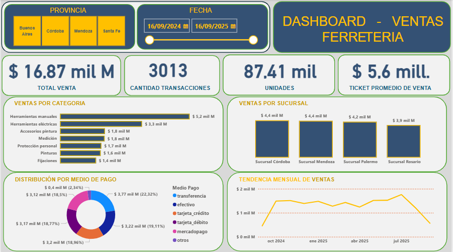

# 📊 Dashboard de Ventas - Sector Ferretero (Power BI)

Este repositorio contiene un panel interactivo y ejecutivo desarrollado en **Power BI** para la gestión, análisis de ventas e indicadores clave (KPIs) de una ferretería.

---

## 🖼️ Vista Previa del Dashboard

---

## 🚀 Métricas y Análisis Incluidos
* **KPIs Principales:** Total Venta, Cantidad de Transacciones, Unidades Vendidas y Ticket Promedio.
* **Segmentación:** Filtros dinámicos por Provincia y Rango de Fechas.
* **Análisis Comercial:** Ventas por Categoría, Rendimiento por Sucursal y Distribución por Medio de Pago.
* **Evolución:** Tendencia Mensual de Ventas.

---

## 🛠️ Herramientas y Técnicas Aplicadas
* **Power BI Desktop:** Modelado de datos y diseño UI/UX en layout estructurado por contenedores.
* **Power Query & DAX:** Limpieza de datos y cálculos de métricas clave.
* **PowerPoint:** Maquetación de plantillas y fondos del lienzo.
